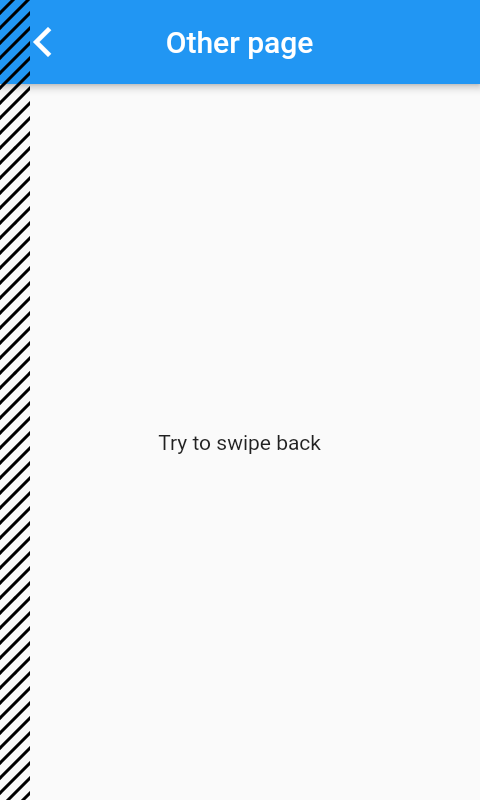
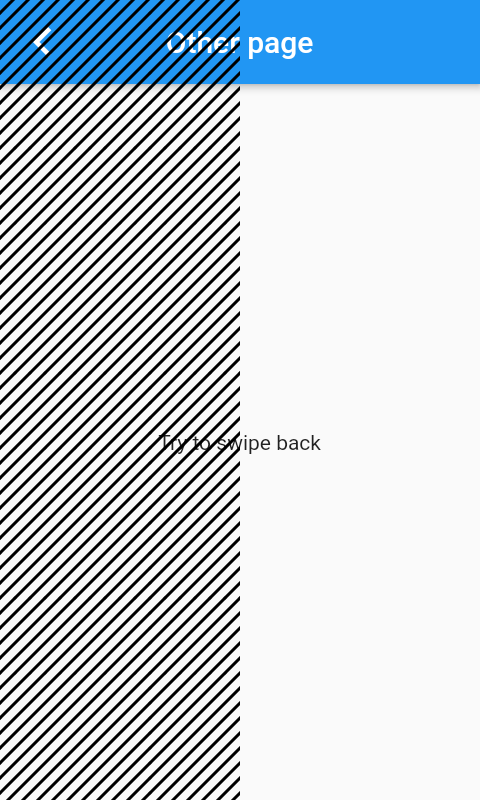

# cupertino_back_gesture

[](https://pub.dev/packages/cupertino_back_gesture)

A Flutter package to set custom width of iOS back swipe gesture area.


## Usage

To use this package, add `cupertino_back_gesture` as a [dependency in your pubspec.yaml file](https://flutter.dev/platform-plugins/).


## Example

To change width of area where the user can start back swipe for the whole app
* Wrap your `MaterialApp` with `BackGestureWidthTheme` with desired `backGestureWidth`
* set iOS builder of `pageTransitionsTheme` to `CupertinoPageTransitionsBuilderCustomBackGestureWidth`

```dart
import 'package:cupertino_back_gesture/cupertino_back_gesture.dart';

BackGestureWidthTheme(
  backGestureWidth: BackGestureWidth.fraction(1 / 2),
  child: MaterialApp(
    theme: ThemeData(
      pageTransitionsTheme: PageTransitionsTheme(
        builders: {
          TargetPlatform.android: FadeUpwardsPageTransitionsBuilder(),
          TargetPlatform.iOS: CupertinoPageTransitionsBuilderCustomBackGestureWidth(),
        },
      ),
    ),
    home: MainPage(),
  ),
)
```

Possible variants for `backGestureWidth` are
* `BackGestureWidth.fixed(w)` where `w` is width in logical pixels
* `BackGestureWidth.fraction(f)` where `f` is fraction of screen width from 0.0 to 1.0


## Screenshots

Areas where back swipe gesture can be started are shaded with hatching

Default Flutter | `BackGestureWidth.fraction(1 / 2)`
--- | ---
 | 


## Example app

Complete example can be found in [example](example/lib/main.dart) folder
